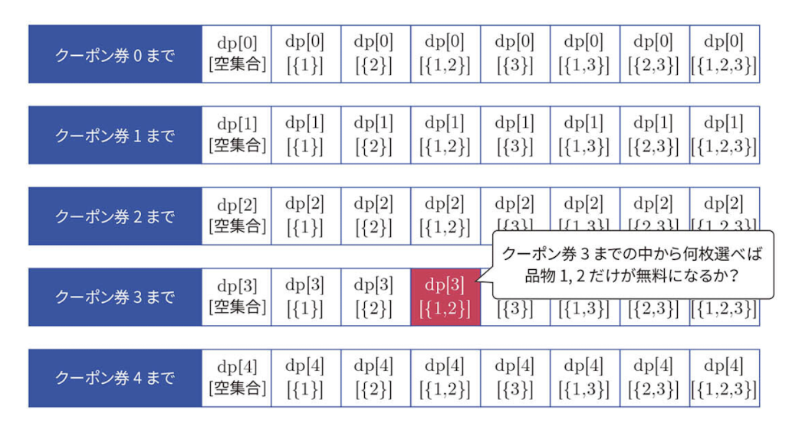
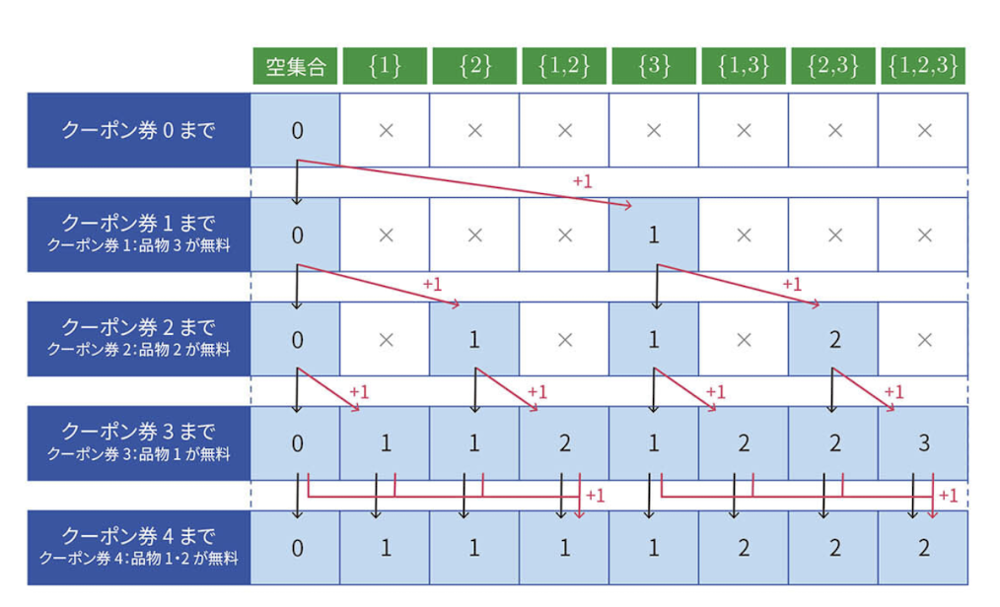

# Bit DP

## 問題

<https://atcoder.jp/contests/tessoku-book/tasks/tessoku_book_w>

## 実装

```python
def bit_dp(n, m, coupons):
    dp = [[INF] * (1 << n) for _ in range(m + 1)]
    dp[0][0] = 0

    bit_coupons = [sum(x << i for i, x in enumerate(c)) for c in coupons]

    for i in range(1, m + 1):
        for j in range(1 << n):
            dp[i][j] = min(dp[i][j], dp[i - 1][j])
            dp[i][j | bit_coupons[i - 1]] = min(
                dp[i][j | bit_coupons[i - 1]], dp[i - 1][j] + 1
            )

    result = dp[m][(1 << n) - 1]

    return result if result != INF else -1
```

## 考え方

### 一般式

$dp[i][S]$ : クーポン $1,2,...,i$ の中から何枚か選び、無料でもらえる品物の集合が $S$ である状態の時、選んだクーポンの枚数として考えられる最小値。

ここで集合 $S$ はビット列として表現する。例えば、無料でもらえる品物が $1$ と $2$ であるとき $011$ と表現し、この集合が表すIndex $j$ は $j = 3$ である。



- クーポン券 $i$ を使わない場合
  - $dp[i][S] = min(dp[i][S], dp[i - 1][S])$
    - クーポン券 $i$ を使わないので、クーポン券 $1,2,...,i - 1$ までと条件は一緒
- クーポン券 $i$ を使う場合
  - $dp[i][S \cup T[i]] = min(dp[i][S \cup T[i]], dp[i - 1][S] + 1)$
    - $T[i]$ は、 $i$ 枚目のクーポン券を使って無料でもらえる品物の集合
    - クーポン券 $i$ を使うことで、無料でもらえる品物の集合は $S$ -> $S \cup T[i]$ になる。もちろんクーポン券の枚数も $1$ 増える。

### DPテーブル

$dp[M + 1][2^N]$

- 行
  - 初期状態(クーポン0枚)と $1,2,...,M$ までのクーポン券 $M + 1$ 行分
- 列
  - 無料でもらえるあり得る品物の集合。 $N$ 個の品物に対し、選ぶ選ばないがあるので、 $2^N$ 列分

### 初期値

$dp[0][0] = 0$

$dp[i][j] = \infty\ (i \neq 0\ or\ j \neq 0)$

- クーポンが何もない時、無料で得られる品物の集合は $\phi$ である。

### 遷移イメージ



### 計算量

$O(2^N \cdot NM)$
