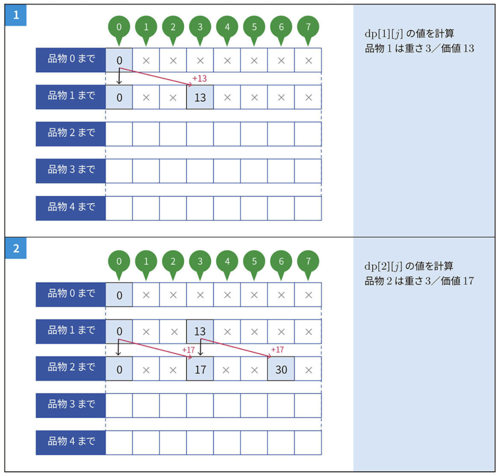
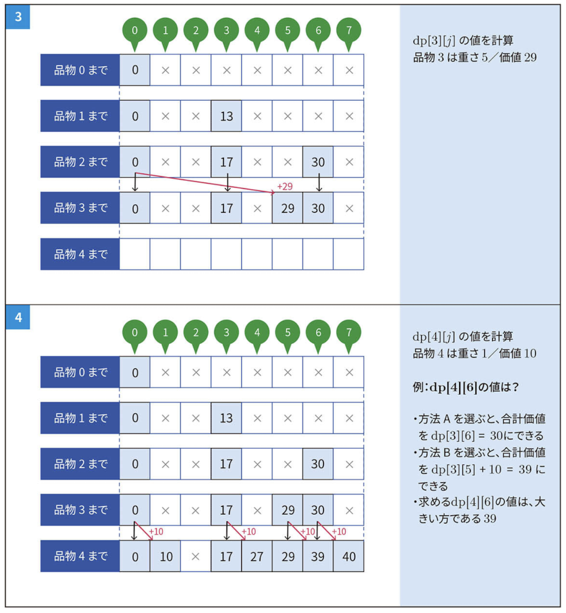

# Knapsack DP

## 問題

容量 $W$ のナップサックを持っている。 $N$ 個のアイテムがあり、それぞれ重さ $w_i$ と価値 $v_i$ である。

このナップサックに入るアイテムを選び、価値の合計を最大化せよ。

## 実装

```python
def knapsack_dp(n, w, items):
    dp = [[0] * (w + 1) for _ in range(n + 1)]

    for i in range(1, n + 1):
        weight, value = items[i - 1]
        for j in range(w + 1):
            dp[i][j] = dp[i - 1][j]
            if j - weight >= 0:
                dp[i][j] = max(dp[i][j], dp[i - 1][j - weight] + value)

    return dp[n][w]
```

## DPテーブル

### 一般式

$dp[i][j]$: アイテム $1, 2, 3, ..., i$ の中から、重さの合計が $j$ となるように選ぶことを考える。このとき、合計価値としてあり得る最大値。

- 方法1: アイテム $i - 1$ の時点で重さの合計が $j$ であり、アイテム $i$ を選ばない。
  - $dp[i][j] = dp[i - 1][j]$
- 方法2: アイテム $i - 1$ の時点で重さの合計が $j - w[i]$ であり、アイテム $i$ を選ぶ。
  - $dp[i][j] = dp[i - 1][j - w[i]] + v[i]$

処理上では、

1. $dp[i][j] = dp[i - 1][j]$ で $i$ 行の価値の総和を、$i - 1$ 行で初期化する。
2. $j - w[i] \geq 0$ である場合、 $dp[i][j]$ と $dp[i - 1][j - w[i]] + v[i]$ の大きい方を取る。

### 用意DPテーブル

$dp[N + 1][W + 1]$

- 行
  - アイテム $1$ から $i$ までを示す。
  - $0$ の時は初期状態であり、アイテムがない状態である。
  - 初期状態とアイテム $N$ 個分で、 $N + 1$ 行を用意する。
- 列
  - 重さの総和を示す。
  - $0$ から求めたい $W$ までの $W + 1$ 列を用意する。

### 初期値

$dp[0][0] = 0$

$dp[i][j] = 0$

- アイテムが何もない状態で作れる価値の総和は $0$ である。

### 遷移イメージ




### 計算量

$O(NW)$
