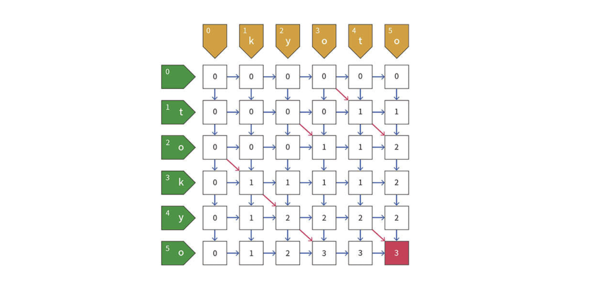

# LCS

## 問題

文字列 $S$ と $T$ の共通部分列（ $S$ の部分列かつ $T$ の部分列）のうち、最長のものは何文字か？

## 実装

```python
def lcs(s, t):
    ls = len(s)
    lt = len(t)
    dp = [[0] * (lt + 1) for _ in range(ls + 1)]

    for i in range(1, ls + 1):
        for j in range(1, lt + 1):
            if s[i - 1] == t[j - 1]:
                dp[i][j] = dp[i - 1][j - 1] + 1
            else:
                dp[i][j] = max(dp[i - 1][j], dp[i][j - 1])

    return dp[ls][lt]
```

## DPテーブル

### 一般式

$dp[i][j]$: $S$ の最初の $i$ 文字と $T$ の最初の $j$ 文字のLCSの長さ

- $S$ の $i$ 文字目と、$T$ の $j$ 文字目が一致する場合
  - $dp[i][j] = dp[i - 1][j - 1] + 1$
  - `NGO` と `NPO` のLCS長は、3文字目 `O` が一致しているため、`NG` と `NP` のLCS長に1足したもの
- $S$ の $i$ 文字目と、$T$ の $j$ 文字目が一致しない場合
  - $dp[i][j] = max(dp[i - 1][j], dp[i][j - 1])$
  - `NGO` と `NPR` のLCS長は、3文字目が異なるので`NG` と `NPR` のLCS長と、`NGO` と `NP` のLCS長の大きい方に一致

### 用意DPテーブル

$dp[|S| + 1][|T| + 1]$

- 行
  - $S$ を表す。
  - $0$ の時は空文字である。
  - 空文字と $|S|$ 文字分で、 $|S| + 1$ 行を用意する。
- 列
  - $T$ を表す。
  - $0$ の時は空文字である。
  - 空文字と $|T|$ 文字分で、 $|T| + 1$ 行を用意する。

### 初期値

$dp[0][0] = 0$

$dp[i][j] = 0$

- 空文字同士のLCSは空文字である。

### 遷移イメージ



### 計算量

$O(|S||T|)$
