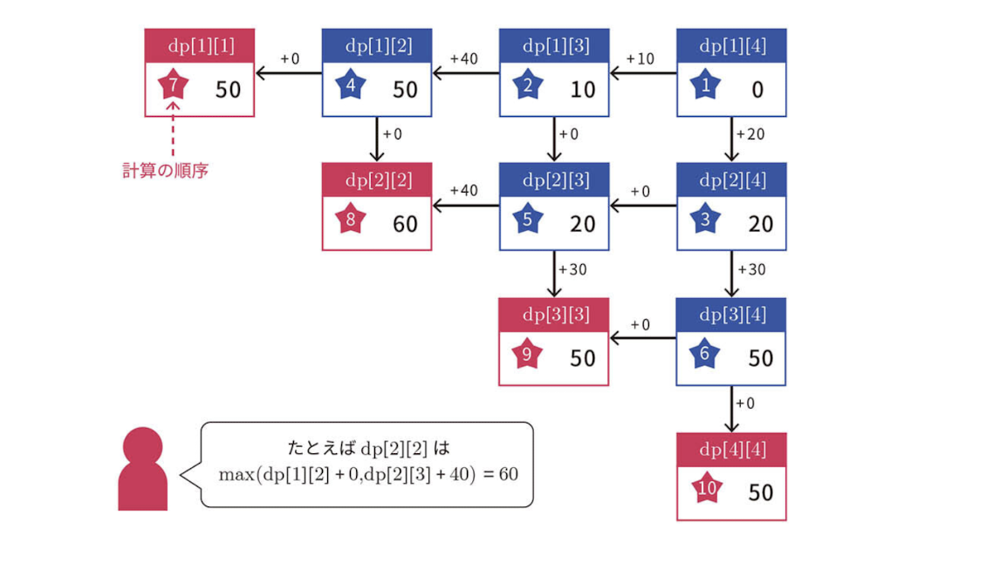

# Segment DP

## 問題

<https://atcoder.jp/contests/tessoku-book/tasks/tessoku_book_u>

## 実装

```python
def segment_dp(n, points):
    dp = [[0] * n for _ in range(n)]

    for l in range(n):
        for r in range(n - 1, l - 1, -1):
            left_score = points[l - 1][1] if l > 0 and l <= points[l - 1][0] <= r else 0
            right_score = (
                points[r + 1][1] if r < n - 1 and l <= points[r + 1][0] <= r else 0
            )

            dp[l][r] = max(
                dp[l][r + 1] + right_score if r < n - 1 else 0,
                dp[l - 1][r] + left_score if l > 0 else 0,
            )

    return max(dp[i][i] for i in range(n))
```

## 考え方

### 前提

どのような操作をしても、残っているブロックは連続した番号になる。


### 一般式

$dp[l][r]$ : $l$ 番目から $r$ 番目までのブロックが残っている状態になるまでに、稼ぐことができる得点の最大値(得点はブロックはブロックがのぞかれるときに加算)。

- 方法1: $dp[l - 1][r]$ の状態から、左端のブロック $l - 1$ を除く。
  - 得られるスコア: $l \leq P[l - 1] \leq r$ のとき、 $A[l - 1]$
    - ブロック $l - 1$ を除いたとき、残っているブロック群にブロック $P[l - 1]$ が存在するという条件
- 方法2: $dp[l][r + 1]$ の状態から、右端のブロック $r + 1$ を除く。
  - 得られるスコア: $l \leq P[r + 1] \leq r$ のとき、 $A[r + 1]$
    - ブロック $r + 1$ を除いたとき、残っているブロック群にブロック $P[r + 1]$ が存在するという条件

以上より、

$dp[l][r] = max(dp[l - 1][r] + score_{l - 1}, dp[l][r + 1] + score_{r + 1})$

$$
score_{l - 1} =
\left\{
\begin{array}{l}
A[l - 1]\ (l \leq P[l - 1] \leq r) \\
0\ (Other)
\end{array}
\right.
$$

$$
score_{r + 1} =
\left\{
\begin{array}{l}
A[r + 1]\ (l \leq P[r + 1] \leq r) \\
0\ (Other)
\end{array}
\right.
$$

### DPテーブル

$dp[N][N]$

- 行, 列
  - ブロック $1$ から $N$ までを表す。

### 初期値

$dp[0][N - 1] = 0$

- ブロックを取り除く前の特典は $0$ である。

### 遷移イメージ



### 計算量

$O(N^2)$
