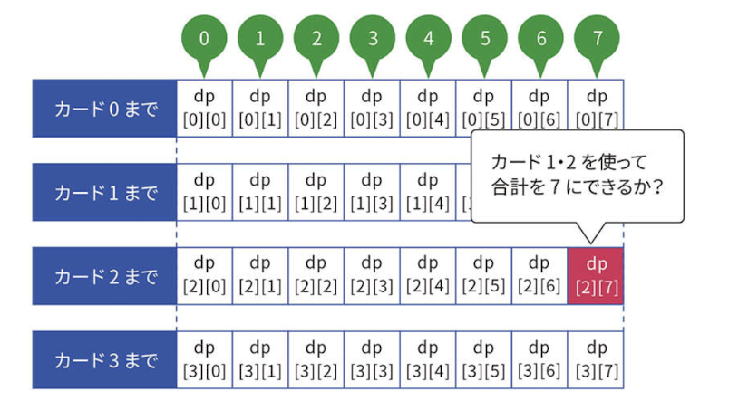
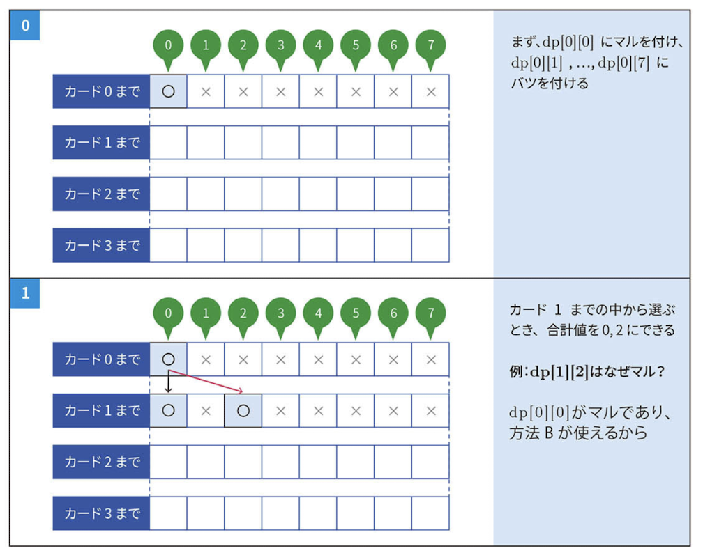
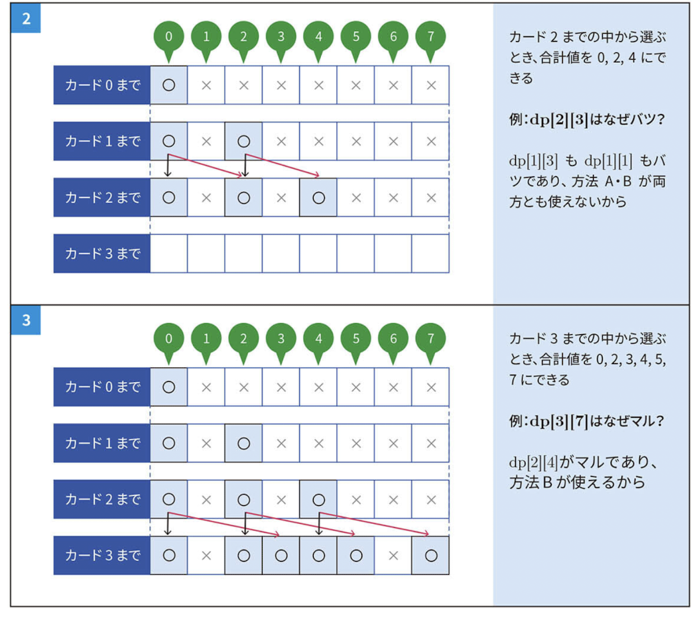

# Subset Sum

## 問題

$N$ 枚のカードが1列に並べられており、左から $i$ 番目のカードには整数 $A_i$ が書かれている。カードの中からいくつかを選んで、書かれた整数の合計が $S$ になることはあるか？

## 実装

```python
def subset_sum_dp(n, s, nums):
    """
    Determines whether a subset sum of s can be formed.

    Parameters:
        n (int): Length of the array
        s (int): Target sum
        nums (List[int]): List of given integers

    Returns:
        bool: True if a subset sum of s can be formed, otherwise False
    """
    dp = [[False] * (s + 1) for _ in range(n + 1)]
    dp[0][0] = True

    for i in range(1, n + 1):
        for j in range(s + 1):
            if dp[i - 1][j]:
                dp[i][j] = True
            if j - nums[i - 1] >= 0 and dp[i - 1][j - nums[i - 1]]:
                dp[i][j] = True
    return dp[n][s]
```

## DPテーブル

### 一般式

$dp[i][j]$: カード $1, 2, 3, ..., i$ の中から何枚か選び、選んだカードに書かれた合計を $j$ にすることは可能か？

- 方法1: カード $i - 1$ の時点で合計が $j$ であり、カード $i$ を選ばない。
  - $dp[i][j] = dp[i - 1][j]$
- 方法2: カード $i - 1$ の時点で合計が $j - A[i]$ であり、カード $i$ を選ぶ。
  - $dp[i][j] = dp[i - 1][j - A[i]]$



### 用意DPテーブル

$dp[N + 1][S + 1]$

- 行
  - カード $1$ から $i$ までを示す。
  - $0$ の時は初期状態であり、カードがない状態である。
  - 初期状態とカード $N$ 枚分で、$N + 1$ 行を用意する。
- 列
  - $0$ 以上の整数値を示す。
    - これは総和として取りうる値である。
  - $0$ から求めたい $S$ までの $S + 1$ 個分を用意する。

### 初期値

$dp[0][0] = True$

$dp[i][j] = False\ (i \neq 0\ |\  j \neq 0)$

- カードが何もない状態で作れる総和は $0$ である。

### 遷移イメージ




### 計算量

$O(NS)$
