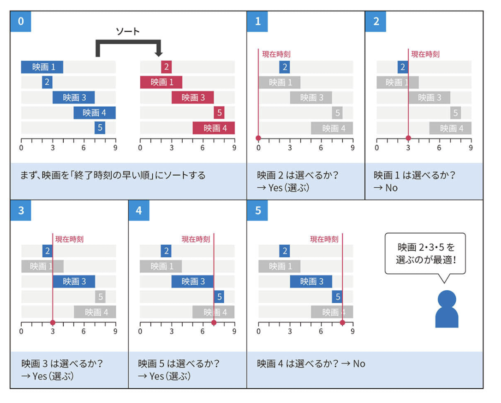

# Interval Scheduling Problem

区間スケジューリング問題

## 問題

それぞれの区間が重複せず、それぞれの区間の数を最大化するためにはどの区間を選択すれば良いか？

## 考え方

貪欲法で考える。

- 区間の右端の数字をキーとして、照準に並び替える
- 並び替えをした区間を順に見ていく
  - その区間の左端 <= 一つ前の区間の右端: その区間を採用する
  - その区間の左端 > 一つ前の区間の右端: その区間を採用しない



```python
def interval_scheduling(arr):
    arr.sort(key=lambda x: x[1])
    count = 1
    cur_end = arr[0][1]

    for l, r in arr[1:]:
        if cur_end <= l:
            count += 1
            cur_end = r

    return count
```
