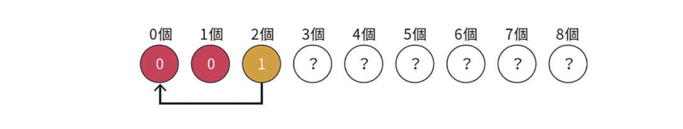

# Grundy数

## 定義

Grundy数とは、以下の規則で定義されるゲームの盤面の状態である。

一回の操作でGrundy数が $x_1, x_2, ...., x_n$ の盤面に推移することができる場合、この盤面のGrundy数は、 $x_1, x_2, ...., x_n$ 以外の最小の非負整数である。

## 具体例

石の山が $1$ 個あり、山には $A$ 個の石が積まれています。2人のプレイヤーが交互に次の操作を行います。

- 山から $X$ 個または $Y$ このの石を取る。( $X < Y$ )

山にある石の数が、 $X$ 個未満になり、操作を行えなくなった方が負けです。両者が最善を尽くした場合、先手と後手どちらが勝ちますか？

### 考え方

$X = 2, Y = 3$ のときを考える。まず、石の数が $0$ または $1$ の場合、操作を行えないのでGrundy数は $0$ である。

石の数が $2$ 個である場合、一手で「石の数が $0$ 個の盤面」に遷移することができる。その時の盤面のGrundy数は $0$ であるため、石が2個の時のGrundy数は $0$ 以外の最小の非負整数である $1$ である。

以下同様に考える。

石の数が $3$ 個の場合:

- 石を $2$ 個取る
  - 石が $1$ 個の盤面に移動する(Grundy数 $0$ )
- 石を $3$ 個取る
  - 石が $2$ 個の盤面に移動する(Grundy数 $0$ )

従って、Grundy数は $0,0$ 以外で最小の非負整数である $1$ となる。

石の数が $4$ 個の場合:

- 石を $2$ 個取る
  - 石が $2$ 個の盤面に移動する(Grundy数 $1$ )
- 石を $3$ 個取る
  - 石が $1$ 個の盤面に移動する(Grundy数 $0$ )

従って、Grundy数は $0,1$ 以外で最小の非負整数である $2$ となる。

Grundy数は以下の性質を持つ。

- Grundy数が $0$ の盤面に遷移できる時
  - Grundy数は $1$ 以上である。
- Grundy数が $0$ の盤面に遷移できない時
  - Grundy数は $0$ である。

この性質より以下のことが言える。

- Grundy数が $0$ の時、後手必勝である。
- Grundy数が $1$ 以上の時、先手必勝である。

## 一般化

石の山が $N$ 個あり、山 $i$ $(1 \leq i \leq N)$ には $A_i$ 個の石が積まれています。2人のプレイヤーが交互に次の操作を行います。

- 好きな山を一つ選び、選んだ山から $X$ 個または $Y$ このの石を取る。( $X < Y$ )

すべての山にある石の数が、 $X$ 個未満になり、操作を行えなくなった方が負けです。両者が最善を尽くした場合、先手と後手どちらが勝ちますか？

### 考え方

山 $i$ のGrundy数を $G_i$ とする。

- $G_1 \oplus G_2 \oplus ... \oplus G_N = 0$ の時、後手必勝
- $G_1 \oplus G_2 \oplus ... \oplus G_N \neq 0$ の時、先手必勝

cf. [Grundy数がXORになることの証明](https://kyopro-friends.hatenablog.com/entry/2023/04/12/195012)
