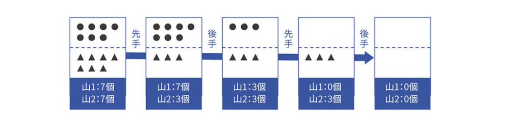
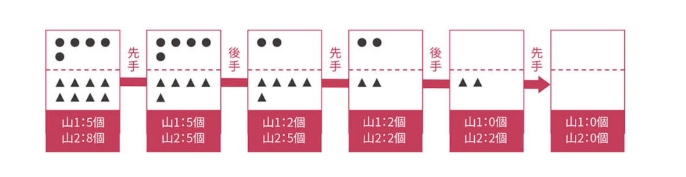
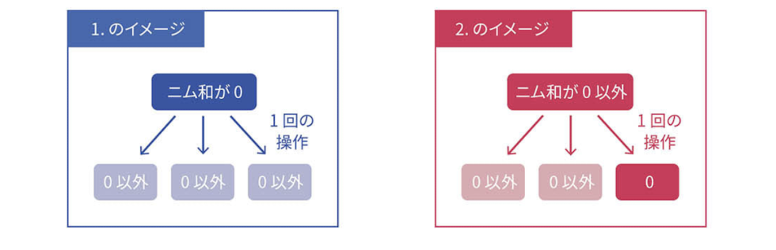
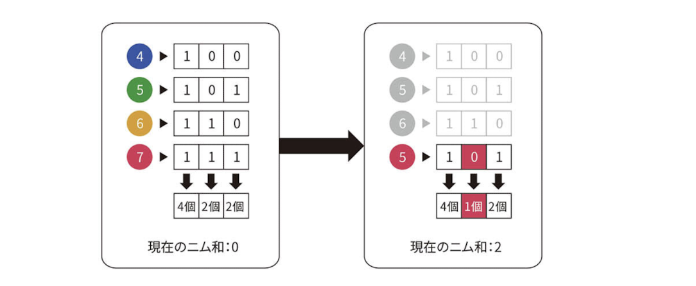
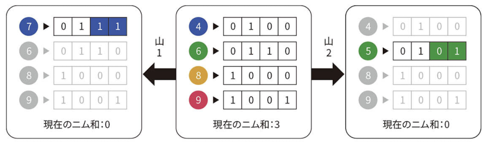

# Nim

## 問題

- 二人で行うゲーム。
- いくつかの山にいくつかの石がある。 $A_1, A_2, ...., A_n$ と表現する。
- プレーヤーは交互に石を取っていく。このとき同時に取れるのは同じ山の石のみ。1回で1個以上最大何個でも取れる。
- 最後の石を取った方が勝ち。

## 考え方

### 山が2つの場合

- $A_1 = A_2$ の時、後手必勝である。
- $A_1 \neq  A_2$ の時、先手必勝である。

#### 証明

先手をプレイヤーX, 後手をプレイヤーYとする。

$A_1 = A_2$ の場合を考える。Yが「直前にXが取った石の数と同じだけ取る」という戦略を用いいると、Yが必ず最後の石を取ることができる。(\*)

$A_1 \neq A_2$ の場合を考える。Xが初手で $|A_1 - A_2|$ 個を多い方の山から取ると、Yが先手としての(\*)と同じ状態になるため、Xが必ず最後の石を取ることができる。

### 山が3つ以上の場合

- $A_1 \oplus A_2 \oplus A_3 \oplus .... \oplus A_n = 0$ の時に、後手必勝
- $A_1 \oplus A_2 \oplus A_3 \oplus .... \oplus A_n \neq 0$ の時に、先手必勝

#### 証明

$A_1 \oplus A_2 \oplus A_3 \oplus .... \oplus A_n$ をニム和と定義し、まず以下を示す。

- ニム和が $0$ である状態から一手操作して、ニム和を $0$ にする方法はない。
- ニム和が $0$ でない状態から一手操作して、ニム和を $0$ にする方法はある。

**命題「ニム和が $0$ である状態から一手操作して、ニム和を $0$ にする方法はない」について:**

操作前のニム和は $0$ であり、2進数のすべての位について 「操作前の石の数が $1$ となっているものの個数」が偶数個である。

一回の操作を行うとどれか1つの山の石の数が減少するため、「操作後の石の数が1となっているものの個数」が奇数個であるような位が、少なくとも1つは出てくる。

よって、ニム和が $0$ 以外の整数となる。

> 例: (4, 5, 6, 7)
> 

**命題「ニム和が $0$ でない状態から一手操作して、ニム和を $0$ にする方法はある」について:**

操作前のニム和 $X$ を二進法で表した時、 $2^{d_1}, 2^{d_2}, ..., 2^{d_k}$ $(2^{d_1} < 2^{d_2} < ... < 2^{d_k})$ の位が1であったとする。この時、ニム和を $0$ にするためには、 $2^{d_1}, 2^{d_2}, ..., 2^{d_k}$ の位を反転させるような石の取り除き方をする必要がある。

この時、 $2^{d_k}$ の位が $1$ である山を選び、その最高位を $0$ にすれば良い。

> - 例(4, 6, 8, 9)
>   - $4 \oplus 6 \oplus 8 \oplus 9 = 3_{(10)} = 0011_{(2)}$
>   - $2^2$ が $1$ である山は $6$ であり、それをビット反転させて $5$ にすることで、ニム和が $0$ になる。
>
> 
